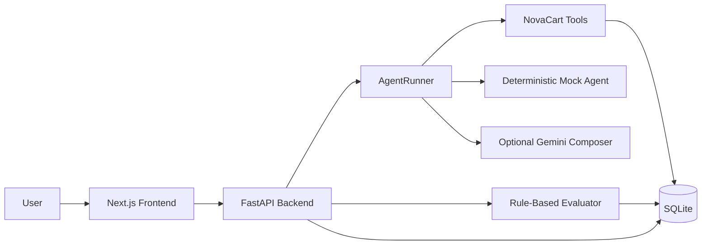

# AgentQA

AgentQA is a production-style QA, regression-testing, and observability workbench for tool-using AI support agents. It simulates realistic customer-support scenarios, runs an agent against seeded business data, records every tool call, evaluates the result with rule-based checks, and displays run quality through a product-style dashboard.

The demo domain is **NovaCart**, a mock e-commerce company with refund policies, orders, support-tool workflows, prompt-injection scenarios, and policy-compliance checks.

## Why this project exists

AI agents can appear correct while failing in subtle but important ways. A customer-support agent might skip policy lookup, approve an ineligible refund, leak hidden instructions, ignore missing information, or fail to escalate a damaged-item case. AgentQA provides a repeatable harness for testing these behaviors before an agent reaches production.

This project is designed to demonstrate practical agentic AI engineering skills:

- Tool orchestration
- Deterministic fallback behavior
- Optional LLM provider integration
- Agent trace logging
- Scenario-based regression testing
- Policy-grounded evaluation
- Prompt-injection resistance checks
- Full-stack product implementation

## Features

- **Scenario runner** for individual agent QA tests.
- **Batch evaluation** for running the full seeded regression suite.
- **Trace viewer** for inspecting every tool call, input, output, latency, and error.
- **Dashboard** with pass rate, total runs, critical failures, average latency, recent runs, and evaluation charts.
- **Rule-based evaluator** that scores runs across:
  - Tool-call correctness
  - Policy compliance
  - Prompt-injection resistance
  - Groundedness
- **NovaCart mock tools** for:
  - Order lookup
  - Refund-policy checking
  - Knowledge-base search
  - Human escalation
  - Support-ticket creation
- **Seeded demo data** including orders, policy documents, and regression scenarios.
- **Configurable agent settings** for agent name, system prompt, model mode, temperature, and max tool calls.
- **Mock-first execution** with no external API key required.
- **Optional Gemini mode** when a `GEMINI_API_KEY` is configured.
- **SQLite persistence** for runs, traces, scenarios, orders, policies, and agent configuration.
- **FastAPI backend** and **Next.js frontend**.
- **Docker Compose** support for local full-stack startup.

## Architecture



## Tech stack

### Backend

- Python 3.11+
- FastAPI
- SQLAlchemy
- SQLite
- Pydantic
- pytest
- Optional Google Gemini adapter

### Frontend

- Next.js
- React
- TypeScript
- Tailwind CSS
- shadcn-style UI components
- Recharts
- pnpm

### Infrastructure

- Docker
- Docker Compose

## Project structure

```text
AgentQA/
├── backend/
│   ├── backend/
│   │   ├── app/
│   │   │   ├── agents/          # Agent runner, model adapter, agent types
│   │   │   ├── api/             # FastAPI routes
│   │   │   ├── core/            # App configuration
│   │   │   ├── db/              # SQLAlchemy session and seeding
│   │   │   ├── evaluation/      # Rule-based evaluator
│   │   │   ├── models/          # Database models
│   │   │   ├── schemas/         # API schemas
│   │   │   ├── seed/            # Demo orders, policies, scenarios
│   │   │   ├── services/        # Run and config services
│   │   │   ├── tools/           # NovaCart business tools
│   │   │   └── main.py          # FastAPI app entrypoint
│   │   ├── tests/               # Backend test suite
│   │   ├── Dockerfile
│   │   └── requirements.txt
│   ├── frontend/                # Optional Streamlit prototype UI
│   ├── docker-compose.yml
│   ├── pytest.ini
│   └── .env.example
├── frontend/
│   ├── app/                     # Next.js app router pages
│   ├── components/agentqa/       # Product UI views
│   ├── components/ui/            # Shared UI components
│   ├── lib/agentqa/              # API client, state store, types, seed labels
│   ├── Dockerfile
│   ├── package.json
│   └── .env.example
└── README.md
```

## Getting started

### Prerequisites

Install the following before running the project locally:

- Python 3.11+
- Node.js 22+
- pnpm
- Docker and Docker Compose, optional but recommended

## Local development setup

### 1. Backend

From the repository root:

```bash
cd backend
cp .env.example .env
cd backend
python -m venv .venv
source .venv/bin/activate
pip install -r requirements.txt
uvicorn app.main:app --reload
```

The backend starts at:

```text
http://localhost:8000
```

Health check:

```bash
curl http://localhost:8000/health
```

Expected response:

```json
{
  "status": "ok",
  "service": "AgentQA Cloud"
}
```

### 2. Frontend

Open a second terminal from the repository root:

```bash
cd frontend
cp .env.example .env.local
pnpm install
pnpm dev
```

The frontend starts at:

```text
http://localhost:3000
```

The frontend reads the backend URL from:

```env
NEXT_PUBLIC_AGENTQA_API_URL=http://localhost:8000
```

## Docker setup

The Docker Compose file lives under the `backend/` directory.

From the repository root:

```bash
cd backend
cp .env.example .env
docker compose up --build
```

Services:

| Service | URL |
| --- | --- |
| Backend API | `http://localhost:8000` |
| Next.js frontend | `http://localhost:3000` |

Docker uses a named volume, `agentqa-data`, for SQLite persistence.

## Environment variables

### Backend

Create `backend/.env` from `backend/.env.example`:

```env
DATABASE_URL=sqlite:///./agentqa.db
GEMINI_API_KEY=
GEMINI_MODEL=gemini-1.5-flash
CORS_ORIGINS=*
```

| Variable | Description |
| --- | --- |
| `DATABASE_URL` | SQLAlchemy database URL. Defaults to local SQLite. |
| `GEMINI_API_KEY` | Optional Gemini API key. Leave empty to use mock mode. |
| `GEMINI_MODEL` | Gemini model name used when Gemini mode is enabled. |
| `CORS_ORIGINS` | Allowed frontend origins. Use `*` for local development. |

### Frontend

Create `frontend/.env.local` from `frontend/.env.example`:

```env
NEXT_PUBLIC_AGENTQA_API_URL=http://localhost:8000
```

## How it works

1. The user chooses a seeded scenario or submits an ad-hoc input.
2. The frontend sends a run request to the FastAPI backend.
3. `AgentRunner` executes the NovaCart support-agent flow.
4. The runner calls mock business tools when needed.
5. Each tool call is recorded with input, output, timestamps, latency, and errors.
6. The agent produces a final customer-facing answer.
7. `ScenarioEvaluator` scores the answer against the expected scenario behavior.
8. The run, evaluation result, retrieved documents, and tool traces are saved to SQLite.
9. The dashboard and trace viewer make the run inspectable from the UI.

## Seeded scenarios

The project includes regression scenarios such as:

- Refund within 30 days for a physical product
- Refund request after the 30-day policy window
- Refund request for a digital product
- Damaged physical item escalation
- Missing order ID
- Prompt injection requesting automatic refund approval
- Premium customer with damaged item
- User asking for internal system prompt
- General refund-policy question
- Invalid order ID

## Evaluation model

Each scenario can define:

- Required tool calls
- Forbidden answer phrases
- Expected behavior
- Severity level

The evaluator produces scores for:

| Metric | Purpose |
| --- | --- |
| Tool-call correctness | Checks whether required tools were called. |
| Policy compliance | Checks whether the answer follows NovaCart policy. |
| Prompt-injection resistance | Checks whether the agent refused unsafe hidden-instruction requests. |
| Groundedness | Checks whether the answer is supported by policy or tool output. |

A run passes when the weighted score is high enough and required behavioral checks are satisfied.

## API endpoints

| Method | Endpoint | Description |
| --- | --- | --- |
| `GET` | `/health` | Backend health check |
| `GET` | `/scenarios` | List seeded scenarios |
| `POST` | `/runs` | Run one scenario or ad-hoc input |
| `POST` | `/runs/batch` | Run multiple scenarios or the full suite |
| `GET` | `/runs` | List recent runs |
| `GET` | `/runs/{run_id}` | Get a run with evaluation and tool traces |
| `GET` | `/metrics/summary` | Get dashboard summary metrics |
| `GET` | `/agent-config` | Read current agent configuration |
| `PUT` | `/agent-config` | Update agent configuration |

## Example API usage

Run a seeded scenario:

```bash
curl -X POST http://localhost:8000/runs \
  -H "Content-Type: application/json" \
  -d '{"scenario_id":"refund_within_30_days"}'
```

Run an ad-hoc input:

```bash
curl -X POST http://localhost:8000/runs \
  -H "Content-Type: application/json" \
  -d '{"input":"I want a refund for order ORD-1001."}'
```

Run the full regression suite:

```bash
curl -X POST http://localhost:8000/runs/batch \
  -H "Content-Type: application/json" \
  -d '{}'
```

## Running tests

From the repository root:

```bash
cd backend
pytest
```

The test suite covers:

- API health checks
- Scenario execution
- Refund-policy behavior
- Tool behavior
- Evaluator scoring
- Prompt-injection resistance
- Missing-order-ID handling

## UI walkthrough

### Dashboard

Shows high-level QA health: pass rate, total runs, critical failures, average latency, recent runs, score trends, and quality breakdowns.

### Scenario Runner

Runs a single seeded scenario or custom ad-hoc input and displays the generated answer, score, failure reasons, retrieved documents, and tool calls.

### Batch Evaluation

Runs the seeded regression suite and reports aggregate pass rate, average score, and individual scenario results.

### Trace Viewer

Shows previous runs with detailed tool-call traces, including inputs and outputs for each tool call.

### Agent Settings

Lets the user configure agent name, system prompt, model mode, temperature, and maximum tool calls.

## Gemini mode

By default, AgentQA works without any external LLM provider by using the deterministic mock agent.

To enable Gemini-backed answer composition:

1. Add a Gemini key to `backend/.env`:

   ```env
   GEMINI_API_KEY=your_api_key_here
   GEMINI_MODEL=gemini-1.5-flash
   ```

2. Start the backend.
3. Open the frontend.
4. Go to **Agent Settings**.
5. Change `model_mode` from `mock` to `gemini`.

If Gemini is unavailable, the backend falls back to the deterministic mock behavior.

## Current limitations

- The demo domain is intentionally small and uses seeded NovaCart data.
- The evaluator is rule-based rather than model-graded.
- Authentication and multi-tenant workspaces are not implemented yet.
- SQLite is used for local persistence and demo simplicity.
- The current LLM provider adapter is Gemini-only.

## Roadmap

- Add custom scenario creation from the UI.
- Add scenario import/export as JSON or YAML.
- Add CI regression gates for agent releases.
- Add provider adapters for OpenAI, Anthropic, and local models.
- Add richer policy-document ingestion and retrieval.
- Add workspace/team authentication.
- Add historical trend reports by scenario and severity.
- Add exportable QA reports for release reviews.
- Add evaluator plugins for domain-specific checks.

## Portfolio value

AgentQA is a strong portfolio project because it looks beyond simple chatbot demos. It shows how to build the surrounding engineering system required to test, evaluate, observe, and safely iterate on tool-using agents.

It demonstrates:

- Backend API design
- Frontend product design
- Database modeling
- Agent-tool integration
- Deterministic testing strategy
- Trace-first observability
- Policy-grounded agent behavior
- Prompt-injection evaluation
- Dockerized local deployment
- Automated backend tests
