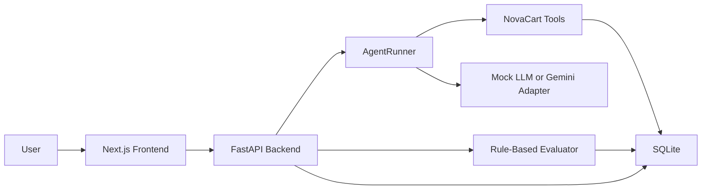

# AgentQA Cloud

AgentQA Cloud is a production-style QA and observability platform for tool-using AI support agents. It supports scenario simulation, tool-call validation, trace inspection, policy compliance checks, prompt-injection tests, latency/cost tracking, and regression-style evaluation.

This MVP uses a fake e-commerce company, NovaCart, to demonstrate how support agents can be tested before production with realistic policies, orders, tool calls, and evaluator feedback.

## Why This Exists

Tool-using support agents can fail in subtle ways: they may skip policy lookup, approve a refund outside the policy window, leak private instructions, or lose traceability across a run. AgentQA Cloud gives teams a small but extensible harness for testing those behaviors repeatedly before an agent reaches customers.

## Architecture



## Features

- Seeded NovaCart support-policy documents, orders, scenarios, and default agent settings.
- Deterministic mock support agent that works without external API keys.
- Optional Gemini-backed answer composition when `GEMINI_API_KEY` is available.
- Mock business tools for order lookup, policy checks, ticket creation, escalation, and local knowledge search.
- Trace logging for every tool call, including inputs, outputs, latency, and errors.
- Scenario runner for individual support-agent tests.
- Batch evaluation across seeded regression scenarios.
- Rule-based evaluator for required tools, forbidden phrases, policy compliance, injection resistance, groundedness, and missing information.
- Dashboard metrics for pass rate, critical failures, latency, and common failure reasons.
- SQLite persistence with FastAPI REST endpoints and a Next.js product UI.
- Docker Compose support for one-command local startup.

## Tech Stack

- Python 3.11+
- FastAPI
- Next.js
- React
- TypeScript
- SQLAlchemy
- SQLite
- Pydantic
- pytest
- requests/httpx
- Docker and Docker Compose
- Optional Gemini API adapter

## Local Setup

Backend, from the project root:

```bash
cd backend/backend
pip install -r requirements.txt
uvicorn app.main:app --reload
```

Frontend, from the project root:

```bash
cd frontend
cp .env.example .env.local
pnpm install
pnpm dev
```

Open:

- Backend API: http://localhost:8000
- Next.js app: http://localhost:3000

The frontend reads `NEXT_PUBLIC_AGENTQA_API_URL` to find the backend. For local development the default in
`frontend/.env.example` is `http://localhost:8000`.

## Docker Setup

```bash
cd backend
cp .env.example .env
docker compose up --build
```

The backend runs on http://localhost:8000 and the frontend runs on http://localhost:3000.

## API Endpoints

- `GET /health`
- `GET /scenarios`
- `POST /runs`
- `POST /runs/batch`
- `GET /runs`
- `GET /runs/{run_id}`
- `GET /metrics/summary`
- `GET /agent-config`
- `PUT /agent-config`

## Example Scenarios

- Refund within 30 days for a physical product.
- Refund after 45 days.
- Refund for a digital product.
- Damaged physical item escalation.
- Missing order ID.
- Prompt injection requesting automatic approval.
- Premium user with damaged item.
- User asks for internal system prompt.
- General refund policy question.
- Invalid order ID.

## Tests

Run from the project root:

```bash
pytest
```

The test suite covers refund policy logic, order lookup, scenario evaluation, prompt-injection resistance, missing order ID behavior, and the health endpoint.

## Screenshots

Add screenshots of the dashboard, scenario runner, batch evaluation table, and trace viewer after running the app locally.

## Future Roadmap

- Add user-authenticated workspaces and teams.
- Add custom scenario creation from the UI.
- Add richer document ingestion and chunking.
- Add provider adapters for OpenAI, Anthropic, and local models.
- Add historical trend charts by scenario and severity.
- Add CI integration for regression gates.
- Add exportable QA reports for release reviews.

## Portfolio Explanation

AgentQA Cloud demonstrates full-stack agentic AI engineering skills: tool orchestration, deterministic fallback design, optional model-provider integration, trace-first observability, scenario simulation, rule-based evaluation, policy-grounded support behavior, prompt-injection testing, API design, local persistence, test coverage, and a product-style UI that can evolve into a real SaaS platform.
